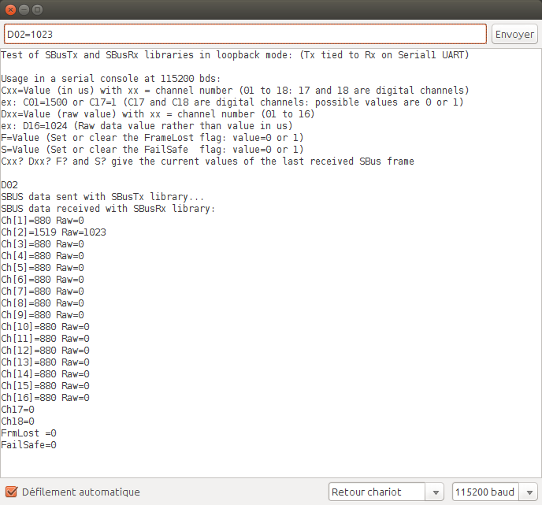

SBusTx library
==============

**SBusTx** is a SBUS generator library used to send the 16 proportionnal channels and the 4 flags transported by the SBUS protocol.
SBUS protocol is mainly used with Futaba and FrSky receivers.
**SBusTx** can simulate the ouput SBUS signal of a SBUS receiver.

Some examples of use cases:
-------------------------
* **Simulation of a SBUS RC receiver**
* **SBUS servo tester (see **SBusServoTester** example)**
* **Test of SBUS receiver library such as SBusRx library**
* **Digital data tranmission over SBUS**

Supported Arduinos:
------------------
All the arduino/micro-controllers equipped with a built-in UART:

* **ATtiny167 (Standalone or Digispark pro)**
* **ATmega368P (UNO)**
* **ATmega32U4 (Arduino Leonardo, Micro and Pro Micro)**
* **ATmega2560 (Arduino MEGA)**

May work with a Software Serial (not tested).

Tip and Tricks:
--------------
Develop your project on an arduino MEGA, Leonardo and then shrink it by loading the sketch in an Micro or Pro Micro or ATtiny167.

API/methods:
-----------
* **SbusTx.serialAttach(Stream *TxStream, uint8_t FrameRateMs = SBUS_TX_NORMAL_TRAME_RATE_MS)**
With:
	* **_TxStream_**: pointer on a serial stream initialized at 100 000 bds, SERIAL_8E2 (eg: &Serial, &Serial1)
	* **_FrameRateMs_**: frame rate in ms (SBUS_TX_NORMAL_TRAME_RATE_MS: 14ms or SBUS_TX_HIGH_SPEED_TRAME_RATE_MS: 7ms)

* **uint8_t SBusTx.isSynchro()**:
	* SBUS synchronization indicator: indicates that the SBUS frame has just been sent. The channel raw data and/or the channel pulse widths and SBUS flags can be set. This is a "clear on read" function (no need to clear explicitely the indicator).

* **uint16_t SBusTx.rawData(uint8_t Ch, uint16_t RawData)**:
	* This method sets the raw data value associated to the requested channel (Ch: 1 to 16).
	* **_RawData_**: raw data value within [0, 2047].

* **uint16_t SBusTx.width_us(uint8_t Ch, uint16_t width_us)**:
	* This method sets the pulse width (in µs) associated to the requested channel (Ch: 1 to 16).
	* **_width_us_**: pulse width in µs within [880, 2160].

* **uint8_t  SBusTx.flags(uint8_t FlagId, uint8_t Value)**
With:
	* **_FlagId_**: the flag identifier among the following choices
	* ** SBUS_TX_CH17**: the status (0/1) of the digital Channel#17
	* ** SBUS_TX_CH18**: the status (0/1) of the digital Channel#18
	* ** SBUS_TX_FRAME_LOST**: the status (0/1) of the frame lost indicator
	* ** SBUS_TX_FAILSAFE**: the status (0/1) of the FailSafe indicator
	* **_Value_**: the flag value (0 or 1)

* **SBusTx.sendChannels()**
	* This method sends the 16 channels and the SBUS flags.

SBusTxRxLoopback example usage:
------------------------------

Contact
-------

If you have some ideas of enhancement, please contact me by clicking on: [RC Navy](http://p.loussouarn.free.fr/contact.html).

